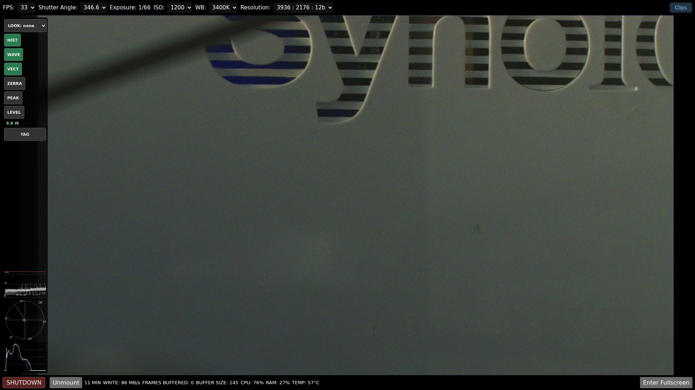
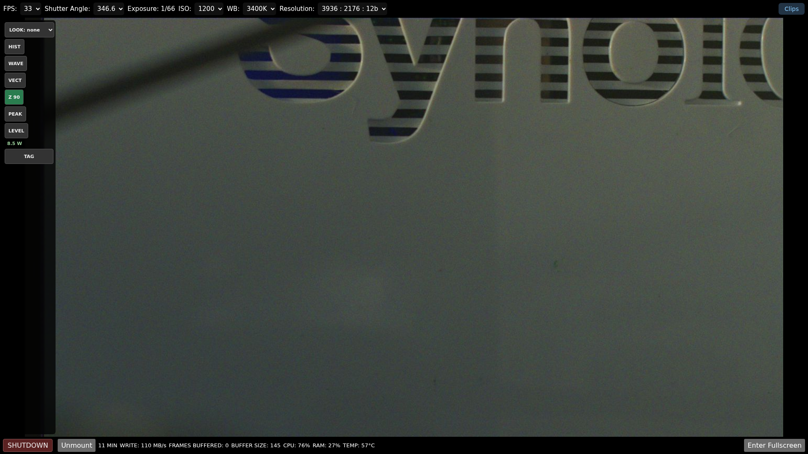
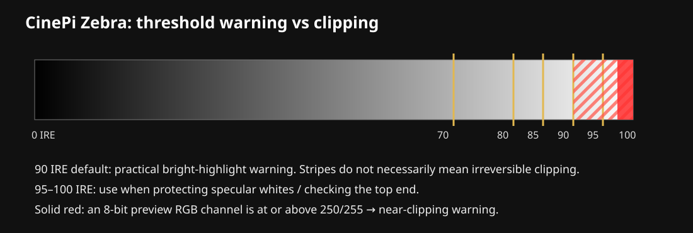
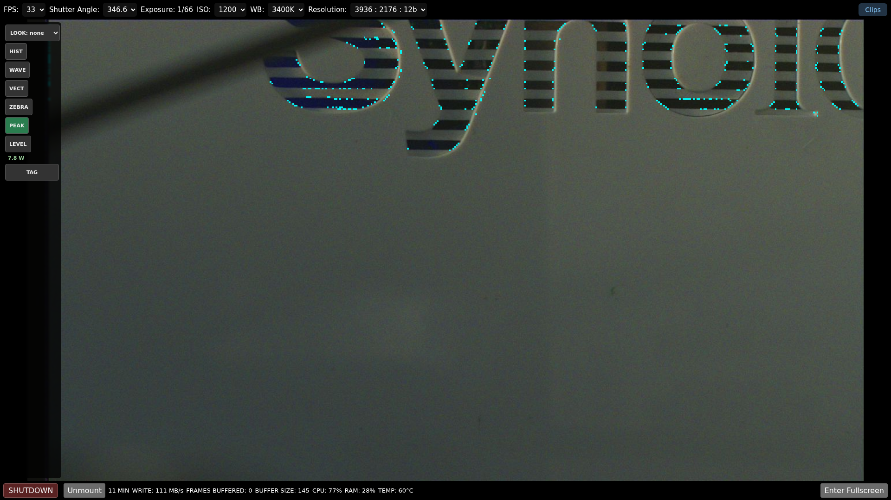
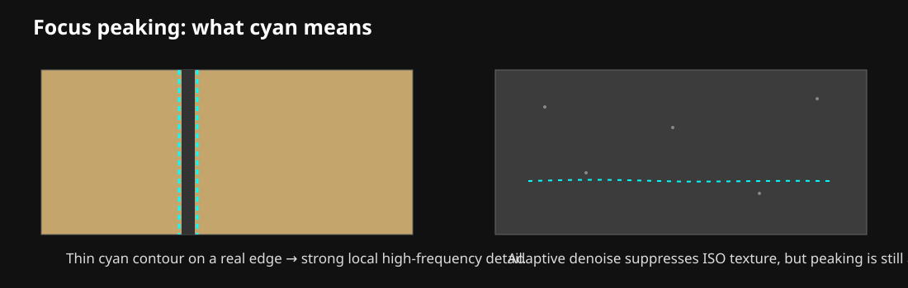
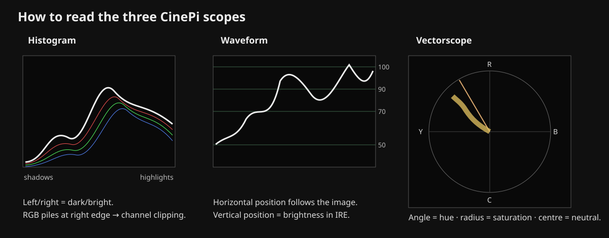
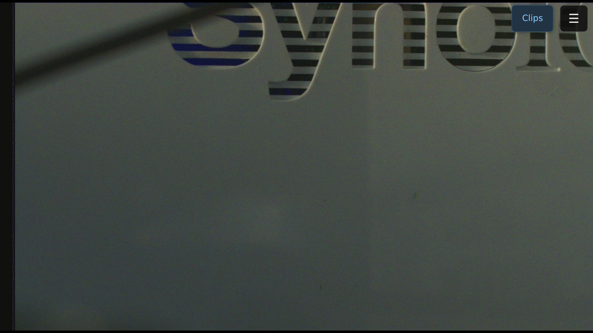

# Monitoring tools: operator guide

CineMate provides a set of live monitoring tools for exposure, focus, colour and camera orientation. This page explains what each tool shows, how to read it and which combinations are useful while shooting.

The monitoring tools analyse the camera's Rec.709 preview signal. A creative LUT can change the displayed picture, but the scopes continue to analyse the underlying source preview so a look cannot hide clipping or change what counts as a focus edge.

*Actual CineMate web interface with Histogram, Waveform and Vectorscope visible beside the live preview.*

## A practical starting point

For general handheld shooting, start with **Z 90 + PEAK + LEVEL**. This gives a quick highlight warning, focus assistance and camera orientation without filling the screen with every scope.

For careful exposure work, use **WAVE + Z 90 + HIST**. Waveform shows where exposure levels occur in the frame, Zebra overlays the affected image areas, and the RGB histogram helps identify channel-specific clipping.

For colour checks, use **VECT + HIST** with LOOK: none or CinePi Rec.709 Reference.

## Zebra

Zebra answers a simple question: **which parts of the image are at or above the selected brightness threshold?**

CineMate uses BT.709 luma for the striped Zebra warning and checks the individual RGB channels separately for near clipping.

### Controls

A short click or tap toggles Zebra on or off.

Hold the Zebra button for about **0.55 seconds** on desktop or touch devices to choose a threshold. The available levels are:

| Setting | Typical use |
| ---: | --- |
| 70 IRE | Skin/exposure reference in workflows that use 70 IRE |
| 80 IRE | Bright faces and light surfaces |
| 85 IRE | Bright diffuse highlights |
| **90 IRE** | CineMate default; practical highlight warning |
| 95 IRE | Very bright highlight protection |
| 100 IRE | Top-end check |

When Zebra is active, the button shows the selected level, for example **Z 90**.

### Reading the overlay

**Striped red** means luma is at or above the selected Zebra level.

**Solid red** means at least one 8-bit preview RGB channel has reached 250/255 or higher. Treat this as a stronger near-clipping warning.

*Actual CineMate web interface with Zebra enabled at the default 90 IRE threshold.*

The earlier 95 IRE-only behaviour was too conservative for practical exposure work. During threshold validation, a deliberately bright test frame produced the following preview distribution:

| Measurement | Result |
| --- | ---: |
| Pixels at or above 90 IRE | 33.296% |
| Pixels at or above 92 IRE | 0.702% |
| Pixels at or above 95 IRE | 0.004% |
| Pixels with any RGB channel at or above 250 | 0.015% |
| Maximum RGB code value | 255 |

This is why the default is now 90 IRE. A frame can look obviously too bright while almost nothing exceeds 95 IRE.

### Exposure workflow

Start at **Z 90**. Raise exposure until important highlights begin to stripe, then reduce exposure until only highlights you are willing to sacrifice remain above the threshold. Check the RGB histogram afterwards to make sure one colour channel is not reaching the right edge much earlier than the others.

A 70 IRE setting can be useful for skin references, but it is not a universal target. Skin brightness varies with complexion, lighting, camera calibration and creative intent.

### What Zebra cannot tell you

Zebra sees the processed 8-bit Rec.709 preview, not the 12-bit Bayer photosites. It is therefore a field exposure aid, not a direct RAW sensor clipping meter.

*Diagram of the selectable Zebra thresholds and the separate near-clipping warning.*

## Focus Peaking

Peaking highlights fine local detail in cyan. It is intended to make manual focus faster without turning every high-contrast region into a thick outline.

The current detector uses BT.709 luminance, a small Gaussian denoise, Sobel gradients, an image-derived noise estimate, an adaptive threshold and local-maximum thinning.

*Actual CineMate preview with the current cyan focus-peaking overlay.*

### How to use it

Choose a detailed feature on the intended focus plane: eyes, eyelashes, lettering, fabric texture or a sharp object boundary. Rotate focus through the subject and watch for the cyan contour to become strongest and most coherent at the desired plane.

Thin continuous contours on real edges are more meaningful than isolated cyan dots.

### High ISO

Noise contains high-frequency detail too. CineMate estimates a noise floor for each analysed frame and increases the peaking threshold in noisier scenes, but no preview-based detector can remove every false edge.

At high ISO, trust coherent contours on real objects more than scattered cyan speckles.

Peaking does not measure optical MTF, depth of field, motion blur or autofocus confidence. It is a manual focus aid.

*Diagram showing the kind of thin coherent edge Peaking is intended to highlight.*

## Histogram

The Histogram shows how much of the image falls into each brightness range. CineMate plots four traces:

- white: BT.709 luma
- red: red channel
- green: green channel
- blue: blue channel

The left side represents shadows and the right side represents highlights. Vertical height represents the number of sampled pixels in that range. Logarithmic scaling keeps small highlight and shadow populations visible.

### What to look for

A trace piled against the **right edge** indicates possible highlight or channel clipping.

If only the red trace reaches the right edge, red-channel detail can be lost before overall luma appears clipped.

A trace piled against the **left edge** means much of the image is close to black. That can be intentional, but at high ISO it may also indicate noisy underexposure.

On a genuinely neutral grey or white target, strong separation between the RGB traces can indicate a white-balance, lighting-spectrum, IR contamination or colour-calibration issue.

The histogram has no spatial information. It can tell you that clipping exists, but not where it is. Use Waveform or Zebra to locate it.

## Waveform

Waveform preserves horizontal image position. The horizontal axis corresponds approximately to left-to-right position in the image, while vertical position represents brightness.

CineMate displays guides at 0, 18, 50, 70, 90 and 100 IRE.

A bright window on the right side of the image therefore appears on the right side of the waveform and rises toward the upper IRE guides. This makes Waveform one of the most useful tools for controlled exposure.

### Exposure workflow

Enable Waveform, identify the subject's horizontal position, then find the corresponding structure in the scope. Check important highlights against the 90 and 100 IRE guides and check important shadows near the bottom. Use Zebra as an image-space confirmation.

Waveform and Zebra together usually provide more useful exposure information than Histogram alone.

## Vectorscope

Vectorscope shows hue and saturation.

The centre represents neutral or very low chroma. Distance from the centre represents saturation, and the angular direction represents hue. CineMate includes the standard R, Y, G, C, B and M directions plus an approximate skin-tone guide.

A trace concentrated near the centre indicates a mostly neutral or desaturated image. A trace stretching strongly toward one direction indicates significant colour saturation in that hue.

If a known neutral grey or white target sits well away from the centre, investigate white balance, lighting spectrum, IR contamination and sensor/CCM calibration.

The skin-tone line is a directional reference rather than a single correct point. Different complexions and saturation levels occupy different distances from the centre, and lighting or grading can move the trace.

*Diagram showing the basic reading direction of Histogram, Waveform and Vectorscope.*

## Level and shake

LEVEL uses the calibrated ICM-42688 IMU to show roll, pitch and camera motion.

Roll rotates the artificial horizon. Pitch moves it vertically. The display can show values such as **R +0.6°  P +3.3°** and changes to the level state when both axes are close to the configured tolerance.

**set zero** makes the current framing the operator reference without replacing the physical IMU calibration.

The live Level tool is separate from post-production stabilization. Each recorded take can also contain the raw 1 kHz IMU stream in **gyro.gcsv** for Gyroflow-based stabilization.

## ETTR advisor

ETTR means *Expose To The Right*: maximize captured signal while preserving important highlights.

CineMate evaluates the brightest RGB channel rather than luma alone. A display such as **ETTR +0.8 EV** means the monitoring signal appears to have roughly 0.8 stops of highlight headroom. A message such as **ETTR: RGB near clip 0.15%** means part of the sampled preview has entered the near-clipping range.

ETTR is an aid, not an instruction to increase exposure regardless of the shot. Aperture, shutter angle, motion blur, depth of field and intended highlight treatment still matter.

## Mobile and landscape use

The monitoring controls are designed to remain usable in landscape on phones and tablets.

*Actual CineMate landscape interface on a phone-sized viewport.*

If the screen becomes crowded, enable only the tools needed for the current task rather than leaving every scope active.

## LUTs and monitoring

Creative LUTs are applied to the displayed preview. The monitoring analysis remains source-referred to the underlying Rec.709 preview.

That means a LUT can make the image look warmer, cooler, brighter or more contrasty without changing what Zebra, Histogram, Waveform, Vectorscope and Peaking measure.

For the most literal camera-side judgement, use LOOK: none or CinePi Rec.709 Reference.

## Accuracy and limitations

Monitoring analysis runs on a reduced **480 × 270** working frame to keep the browser responsive. The visible preview and 3D LUT remain at display resolution.

As a result:

- very small features may not appear in the scopes
- Peaking is not full-resolution RAW focus analysis
- Zebra and ETTR do not read Bayer photosites directly
- Waveform and Vectorscope are field tools, not laboratory compliance scopes

## Quick reference

| Tool | Best question to ask |
| --- | --- |
| HIST | Are shadows, highlights or individual RGB channels bunching at an edge? |
| WAVE | Where in the frame are those exposure levels? |
| VECT | Which hue direction and saturation dominate? |
| ZEBRA | Which regions exceed the selected IRE threshold? |
| PEAK | Where is strong fine detail likely to be focused? |
| LEVEL | Is the camera level in roll and pitch, and how stable is it? |
| ETTR | How much highlight headroom appears to remain? |
